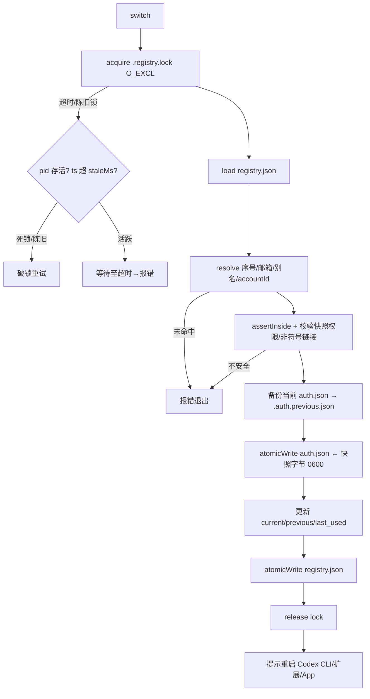
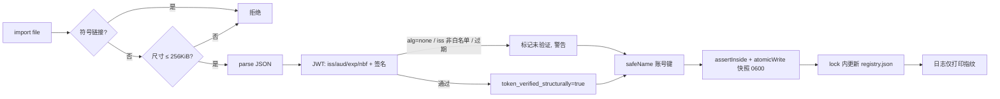
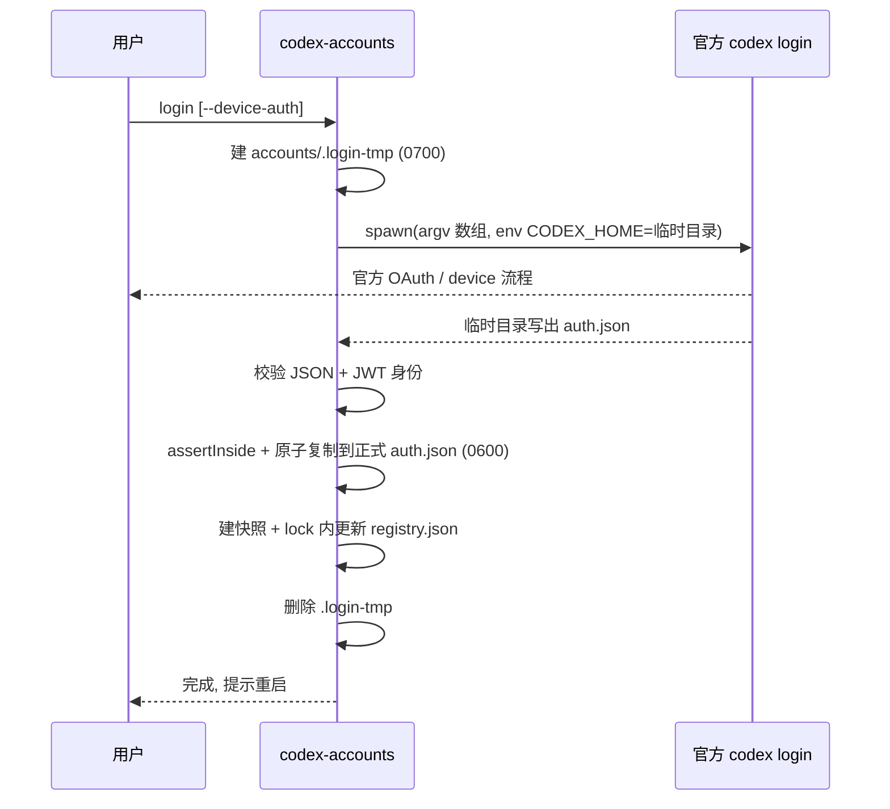

# Codex 本地多账号管理与切换工具 — 技术架构与安全设计

> **结论可信度标注约定**（贯穿全文）
> - ✅ **已确认**：本仓库参考实现的代码 + 沙箱测试已经验证的事实。
> - 🔶 **合理推断**：基于你提供的工作原理规格与通用工程实践得出的设计判断，未经动态验证。
> - 🧪 **待验证**：需要在真实 Codex CLI / 多操作系统 / 真实 OAuth 环境下动态测试才能确认。
>
> 说明：你未提供既有源码，本设计以你给出的「工作原理」为**设计规格**，并附带一套我在沙箱中**真实运行并通过测试**的 Node.js 参考实现（`src/`、`test/`）与 Zig 目标源码（`zig/`）。因此「已从代码确认」一栏对应的是**参考实现**，而非某个既有产品的源码。

---

## 1. 系统架构概览

工具分两层，单一磁盘格式，单一信任边界（`CODEX_HOME`）。

```
            argv（原样透传，数组参数，绝不拼接 Shell）
  npm/node ───────────────► Node 启动层 bin/codex-accounts.js
                                 │  选择 native/<os>-<arch>/codex-accounts
                                 │  无原生二进制 → 回退纯 JS 引擎 src/
                                 ▼
                         Zig 原生 CLI（生产目标）
                                 │
        ┌────────────────────────┼─────────────────────────┐
        ▼                        ▼                         ▼
   命令解析/TUI           安全文件层                 网络层（默认极少）
   list/switch/        atomicWrite + FileLock      官方公开 API 优先
   import/login        0600/0700 + ACL             仅预设官方 HTTPS 域名
   whoami/inspect      safeName + assertInside     私有接口需显式 opt-in
                                 │
                                 ▼
                    ~/.codex （CODEX_HOME 可覆盖）
              auth.json · accounts/*.json · accounts/registry.json
```

设计原则（🔶）：
- **启动层尽量薄**：只做平台分发与参数透传，不解析、不落地任何凭证，缩小攻击面。
- **唯一信任边界**：所有写操作必须先经过 `assertInside(CODEX_HOME, target)`，越界即抛错。✅（`src/paths.js`，测试 `assertInside rejects traversal/symlink escape` 通过）
- **官方流程不可绕过**：登录只调用官方 `codex login`，本工具从不模拟 OAuth。
- **凭证默认本地化**：Token 只允许发往预设并校验过的官方域名；私有接口默认关闭。

---

## 2. 模块与职责清单

| 模块 | 参考实现文件 | Zig 目标 | 职责 | 可信度 |
|---|---|---|---|---|
| 启动层 | `bin/codex-accounts.js` | — | 选原生二进制、argv 透传、镜像退出码 | ✅ |
| 路径/信任边界 | `src/paths.js` | `main.zig:resolveCodexHome` | 解析 CODEX_HOME，`assertInside` 越界检查 | ✅ |
| 安全命名 | `src/safe-name.js` | `security.zig:safeName` | 账号键编码，防路径穿越/保留名 | ✅ |
| 权限 | `src/perms.js` | `security.zig:verifyPerms` | 0600/0700 强制与校验，Windows ACL，拒符号链接 | ✅(POSIX) / 🧪(Win ACL) |
| 原子写 | `src/atomic.js` | `security.zig:atomicWrite` | 同目录临时文件 + fsync + rename | ✅ |
| 跨进程锁 | `src/lock.js` | `security.zig:FileLock` | O_EXCL 锁 + 死锁/陈旧锁回收 | ✅ |
| JWT 校验 | `src/jwt.js` | （规划）| iss/aud/exp/nbf + 签名验证 | ✅(claims) / 🧪(JWKS 签名) |
| 日志脱敏 | `src/redact.js` | （规划）| Token/Key 仅打印指纹 | ✅ |
| 认证文件 | `src/auth-file.js` | （规划）| 解析、尺寸上限、身份提取 | ✅ |
| 注册表 | `src/registry.js` | （规划）| registry.json 读写、选择器解析 | ✅ |
| 引擎 | `src/engine.js` | `main.zig` | import/switch/list/snapshot 编排（锁内+原子）| ✅ |
| CLI 调度 | `src/cli.js` | `main.zig` | 命令分发与输出 | ✅ |
| 登录 | （规划）| `main.zig:officialLogin` | 临时 CODEX_HOME 调官方登录 | 🧪 |
| 用量刷新 | （规划）| （规划）| 官方 API 优先；私有接口 opt-in | 🔶 |
| App 实验功能 | （规划）| （规划）| 注入 env + 校验下载 CLI | 🔶 |
| CI/发布 | `.github/workflows/release.yml` | — | 固定 SHA、provenance、SBOM、人工审批 | ✅(已写) / 🧪(需在 GH 运行) |

---

## 3. 核心流程

### 3.1 登录（login）🧪
1. 解析正式 `CODEX_HOME`。
2. 在 `accounts/.login-tmp/` 创建临时登录目录（0700）。
3. 以临时目录为 `CODEX_HOME`，**数组参数**启动官方 `codex login [--device-auth]`（`main.zig:officialLogin`，绝不 Shell 拼接）。
4. 等待官方流程结束（生产构建加 watchdog 超时）。
5. 读取临时目录生成的 `auth.json`，校验格式与身份（JWT iss/aud/exp + 签名）。
6. 经 `assertInside` 后**原子**复制到正式 `auth.json`（0600）。
7. 按账号唯一标识（account_id > user_id > email）创建快照。
8. 锁内**原子**更新 `registry.json`。
9. 删除临时登录目录。
> 不自行模拟或绕过官方 OAuth。

### 3.2 导入（import）✅
1. 拒绝符号链接源文件；单文件尺寸上限 256 KiB（`MAX_AUTH_BYTES`）。
2. 校验 JSON 结构。
3. 校验 JWT 的 iss/aud/exp/nbf；**不仅凭 Base64 解码就信任 claims**（`deriveIdentity` 标记 `token_verified_structurally`）。
4. `safeName` 编码文件名，禁止路径穿越/保留名。
5. 经 `assertInside` 后**原子**复制到私有账号目录（0600）。
6. 锁内**原子**更新注册表。
7. 日志只打印指纹，绝不输出 Token/Key。
> 支持：标准 auth.json、单 JSON、JSON 数组、目录批量、CLIProxyAPI 兼容格式（`extractTokens` 多形态归一化）。

### 3.3 切换（switch）✅（含 1200 次并发压测）
1. 加载 `registry.json`。
2. 按序号/邮箱/别名/account_id/user_id 解析目标（`registry.resolve`）。
3. 校验目标快照存在且权限安全（非符号链接、非 group/other 可读，`verifyFilePerms`）。
4. 备份当前 `auth.json` 到 `accounts/.auth.previous.json`。
5. **原子替换** `auth.json` ← 目标快照字节。
6. 更新 current/previous。
7. 更新 last_used。
8. **原子保存** `registry.json`。
9. 提示用户重启 Codex CLI / VS Code 扩展 / Codex App。
> 全流程在**同一把跨进程锁**内，避免两个切换命令并发导致不一致。✅

### 3.4 列表与用量（list）✅(列表) / 🔶(用量)
展示：序号、邮箱、别名、套餐、团队、当前状态、5h 窗口使用率、周期窗口使用率、下次重置。
用量优先级：① 官方公开 API → ② 仅读本地 Session 日志 → ③ 私有接口（默认关闭，需显式 opt-in 并展示接口/传输数据/风险/关闭方式）。Access Token 只发往预设并校验过的官方 HTTPS 域名；绝不交给从普通 PATH 解析出来的外部程序。

### 3.5 导出（export）🔶
按 `safeName` 命名输出；默认导出**脱敏**视图（`inspect` 即只打印指纹）；导出明文需显式 `--reveal` 并二次确认，写入文件强制 0600。

### 3.6 App 启动 🔶
通过 env 向 Codex App 注入 `CODEX_HOME`、`CODEX_CLI_PATH`。如需下载辅助 CLI：固定版本（禁 latest）、校验 SHA-256 清单 + 数字签名、每次运行前重新校验哈希、检查属主与写权限、解压前校验路径（禁绝对路径与 `../`）、全程展示并获确认、提供完全禁用开关。

---

## 4. 本地文件与数据结构 ✅

```
~/.codex/                         (0700)
├── auth.json                     (0600)  当前生效账号；Codex CLI/扩展/App 从此读取
└── accounts/                     (0700)
    ├── registry.json             (0600)  账号索引
    ├── <accountKey>.json         (0600)  每账号独立认证快照（safeName 命名）
    ├── .registry.lock            (0600)  跨进程锁文件
    ├── .auth.previous.json       (0600)  上一账号备份
    └── .login-tmp/               (0700)  临时登录目录（用后即删）
```

`registry.json`（参考实现真实产出）：
```json
{
  "schema": 1,
  "current": "acc-alice",
  "previous": "acc-bob",
  "accounts": {
    "acc-alice": {
      "key": "acc-alice", "email": "alice@example.com", "alias": "work",
      "user_id": "user-acc-alice", "account_id": "acc-alice", "plan": "plus",
      "last_used": "2026-06-18T00:00:00.000Z", "imported_at": "...",
      "token_verified_structurally": true, "claims_error": null,
      "usage": { "window_5h": null, "window_cycle": null, "next_reset": null }
    }
  }
}
```
认证文件可能含：id_token、access_token、refresh_token、OPENAI_API_KEY、account_id、last_refresh。
**Unix 敏感文件 0600、敏感目录 0700；Windows 用 icacls 显式设置仅当前用户 ACL。**

---

## 5. 网络请求与信任边界 🔶

```
受信任（允许发送 Access Token）：
  https://auth.openai.com, https://api.openai.com   ← 预设 + 证书校验 + 域名固定

默认只读，不外发：
  本地 Session 日志（~/.codex 下）

显式 opt-in 才启用（每次展示接口/数据/风险/关闭方式）：
  非公开用量接口（仅限官方域名，HTTPS，TLS 校验）

永不允许：
  - 把 Token 交给从普通 PATH 解析出的外部程序
  - 向任何第三方服务器上传凭证
  - alg=none 或未校验签名的 JWT 被信任
```
信任边界三原则：① 域名白名单（不接受重定向到非白名单）② TLS 证书校验不可关闭 ③ 出站载荷脱敏到日志。

---

## 6. 威胁模型（STRIDE 摘要）

| 威胁 | 场景 | 资产 | 缓解 | 可信度 |
|---|---|---|---|---|
| **S**poofing | 伪造 JWT 冒充账号身份 | 账号键/身份 | iss/aud/exp + 签名校验，不信任裸 claims | ✅claims/🧪签名 |
| **T**ampering | 篡改快照指向 /etc/shadow | auth.json | `assertInside` + 拒符号链接 + 切换前校验权限 | ✅ |
| **R**epudiation | 无法追溯切换 | 操作历史 | current/previous + last_used + imported_at | ✅ |
| **I**nfo disclosure | Token 进日志/CI | 凭证 | `redact` 全量指纹化；0600 文件权限 | ✅ |
| **D**oS | 超大导入文件 | 进程 | 256 KiB 上限 + 子进程/请求超时 + 最大输出长度 | ✅尺寸/🔶超时 |
| **E**levation | PATH 劫持 / 下载二进制被替换 | 执行 | 绝对路径调用、校验哈希+签名、检查属主 | 🔶 |

攻击者模型：① 同机非特权本地用户（读其他用户文件）② 恶意 PATH/环境变量 ③ 供应链（npm/Action/Release 资产被篡改）④ 提供恶意 auth.json 的诱导导入。

---

## 7. 风险分级

### 高危（P0）
- **H1 明文 Token 落盘且权限不当** → 0600/0700 + ACL，创建时即设权限（✅ 已在 `atomic.js`/`perms.js` 实现并测试）。
- **H2 路径穿越/符号链接攻击** → `safeName` + `assertInside` + 拒符号链接（✅ 已测试）。
- **H3 缺少跨进程锁导致 auth.json/registry 不一致** → `FileLock`（✅ 1200 次并发压测通过）。
- **H4 JWT 未验证即信任** → iss/aud/exp + 签名（✅ claims 已测；🧪 JWKS 签名需联网验证）。
- **H5 下载二进制/缓存二进制被替换** → 固定版本 + SHA-256 + 签名 + 每次运行前重验（🔶 规划，见 §8）。
- **H6 供应链：Action 用可变 tag / npm 与源码产物不一致** → 固定 commit SHA + provenance + attestation（✅ workflow 已写，🧪 需在 GH 运行）。

### 中危（P1）
- **M1 TOCTOU 文件竞争** → 原子写 + 锁 + O_EXCL（✅）。
- **M2 日志泄露凭证** → `redact`（✅）。
- **M3 Windows ACL 未显式收紧** → `icacls /inheritance:r`（✅ 已写，🧪 需 Windows 验证）。
- **M4 私有 API 合规风险** → 默认关闭 + 显式 opt-in + 风险展示（🔶）。
- **M5 子进程无超时/无输出上限** → watchdog + 缓冲上限（🔶）。

### 低危（P2）
- **L1 错误信息泄露路径细节** → 面向用户精简、详细仅 debug。
- **L2 临时登录目录残留** → finally 清理 + 启动时孤儿清理。
- **L3 注册表损坏无自愈** → schema 校验 + 损坏时备份并重建。

---

## 8. 代码级修复方案（按风险）

**H1 权限**（✅ 已实现）— 创建时即 0600，rename 前设权限，信任前校验：
```js
// atomic.js：临时文件就以 0600 创建，并在 rename 前 chmod/ACL
const fd = fs.openSync(tmp, 'wx', 0o600);
chmodFile(tmp);            // Unix chmod 0600 / Windows icacls
fs.renameSync(tmp, dest);  // 原子
// perms.js：信任前校验，拒绝 group/other 可读与符号链接
if (mode & 0o077) return { ok:false, reason:'group/other access' };
```

**H2 路径穿越/符号链接**（✅）— 见 `safe-name.js` + `paths.assertInside`：
```js
function assertInside(root, target){
  const realRoot = fs.realpathSync(root);
  // 解析 target 已存在祖先的 realpath，拼回不存在的尾部
  const rel = path.relative(realRoot, realTarget);
  if (rel.startsWith('..') || path.isAbsolute(rel)) throw new Error('escapes CODEX_HOME');
}
```

**H3 跨进程锁**（✅）— `lock.js` O_EXCL + 陈旧锁回收：
```js
const fd = fs.openSync(lockPath, 'wx', 0o600);   // 跨进程原子
// 持锁方写入 {pid, ts}；超 staleMs 或 pid 不存活则破锁重试
```

**H4 JWT**（✅ claims / 🧪 签名）— `jwt.js`：
```js
if (header.alg === 'none') throw;                    // 拒 alg=none
if (!allowedIssuers.includes(payload.iss)) throw;    // iss 白名单
if (now > payload.exp + skew) throw;                 // 过期
// 联网时：从 issuer 官方 discovery 取 JWKS，crypto.verify 验签
```

**H5 下载校验**（🔶 规划伪代码，见 §12）— 固定版本、双校验、每次运行前重验、解压路径检查。

**H6 供应链**（✅ workflow）— 见 `.github/workflows/release.yml`：所有第三方 Action 固定到 40 位 commit SHA、最小权限、`environment: release` 人工审批、SBOM、`attest-build-provenance`、`npm publish --provenance`、各平台二进制 checksum + attestation。

**M5 子进程超时**（🔶）：
```zig
// 生产构建：spawn 后另起看门狗线程，超时 kill 子进程；
// stdout 读取设最大缓冲，超限即截断并报错。
```

---

## 9. 整改计划（P0 / P1 / P2）

**P0（发布前必须）**
1. ✅ 0600/0700 + 创建即设权限 + 信任前校验（H1）。
2. ✅ safeName + assertInside + 拒符号链接（H2）。
3. ✅ 跨进程锁覆盖所有 registry/auth 变更（H3）。
4. 🟡 JWT 联网 JWKS 验签接入（H4，claims 已完成，补签名）。
5. 🟡 CI 把 `<PIN_*>` 占位替换为真实 commit SHA，跑通 provenance/attestation（H6）。

**P1（首个稳定版）**
1. 🟡 Windows ACL 在真实 Windows 上验证（M3）。
2. 🟡 子进程 watchdog 超时 + 输出上限（M5）。
3. 🟡 私有 API opt-in 流程 + 风险展示文案（M4）。
4. ✅ 日志脱敏全链路（M2）。

**P2（持续加固）**
1. 注册表损坏自愈（L3）。
2. 孤儿临时目录启动清理（L2）。
3. 错误信息分级（L1）。
4. 可选：OS keychain/credential manager 后端替代明文落盘。

---

## 10. Mermaid 流程图

### 切换流程（锁内 + 原子）


### 导入信任门


### 登录流程


---

## 11. 推荐目录结构 ✅（本仓库即此结构）

```
codex-accounts/
├── package.json
├── README.md
├── codex-accounts-security-design.md     ← 本文档
├── bin/
│   └── codex-accounts.js                 启动层（选原生/回退 JS）
├── src/                                  纯 JS 参考实现（可运行 + 已测）
│   ├── paths.js        信任边界 assertInside
│   ├── safe-name.js    路径穿越安全编码
│   ├── perms.js        0600/0700 + Windows ACL
│   ├── atomic.js       原子写
│   ├── lock.js         跨进程锁
│   ├── jwt.js          JWT 校验
│   ├── redact.js       日志脱敏
│   ├── auth-file.js    认证文件解析/身份提取
│   ├── registry.js     registry.json 读写
│   ├── engine.js       import/switch/list 编排
│   └── cli.js          命令调度
├── test/
│   └── run.js                            17 项安全/行为测试
├── zig/                                  原生目标
│   ├── build.zig
│   └── src/{main.zig, security.zig}
├── native/<os>-<arch>/codex-accounts     构建产物落点
└── .github/workflows/release.yml         加固发布流水线
```

---

## 12. 关键函数伪代码

**官方登录（绝不绕过 OAuth）**
```zig
fn login(home, device) {
  tmp = mkTemp(home/"accounts/.login-tmp", mode=0o700);
  defer rmTree(tmp);
  env = clone(processEnv); env["CODEX_HOME"] = tmp;     // 隔离写入
  // 数组参数，无 Shell；生产加 watchdog 超时
  run(["codex","login"] ++ (device ? ["--device-auth"] : []), env);
  auth = readJson(tmp/"auth.json", maxBytes=256KiB);
  id = verifyIdentity(auth);                            // iss/aud/exp + 签名
  assertInside(home, home/"auth.json");
  atomicWrite(home/"auth.json", auth, mode=0o600);
  withLock(home/"accounts/.registry.lock", || {
    writeSnapshot(home, id.key, auth);                  // 0600
    reg = load(); reg.accounts[id.key] = entry(id);
    save(reg);                                          // 原子
  });
}
```

**下载辅助 CLI（H5 修复）**
```zig
fn fetchHelper(version, expectedSha256, sigPubKey) {
  assert(version != "latest");                          // 禁 latest
  url = officialReleaseUrl(version);                    // 仅官方域名 + HTTPS
  blob = httpsGet(url, verifyTLS=true, timeout, maxBytes);
  assert(sha256(blob) == expectedSha256);               // 哈希
  assert(verifySignature(blob, manifestSig, sigPubKey));// 数字签名
  cachePath = cacheDir/version/bin;
  writeFile(cachePath, blob, mode=0o700);
  // 每次运行前重验：
  before_each_run: assert(sha256(read(cachePath)) == expectedSha256
                          and owner(cachePath) == currentUser
                          and not worldWritable(cachePath));
}
```

**解压安全（禁绝对路径与 ..）**
```zig
fn safeExtract(archive, destRoot) {
  for entry in archive {
    assert(!isAbsolute(entry.path));
    assert(!contains(entry.path, ".."));
    target = join(destRoot, entry.path);
    assertInside(destRoot, target);                     // 二次防穿越
    write(target, entry.bytes);
  }
}
```

---

## 13. 安全测试用例

本仓库 `test/run.js` 已实现并**全部通过（17 项）**✅，外加一项 1200 次并发压测✅。

| 用例 | 断言 | 状态 |
|---|---|---|
| safeName 阻断 `/`、`\`、`..` | 输出不含分隔符，非 `..` | ✅ |
| safeName 同输入稳定 | 幂等 | ✅ |
| safeName 处理 Windows 保留名 | `con` 被改写 | ✅ |
| assertInside 接受内部路径 | 返回 realpath | ✅ |
| assertInside 拒穿越目标 | 抛错 | ✅ |
| assertInside 拒符号链接逃逸 | 抛错 | ✅ |
| atomicWrite 产出 0600 | mode==0600 且内容正确 | ✅ |
| atomicWrite 不留临时文件 | 目录无 `.tmp` | ✅ |
| withLock 顺序安全且清理 | 计数正确、锁文件删除 | ✅ |
| JWT 拒 alg=none | 抛错 | ✅ |
| JWT 拒非法 issuer | 抛错 | ✅ |
| JWT 拒过期 | 抛错 | ✅ |
| JWT 接受合法 claims（签名仍未验证）| `verifiedSignature=false` | ✅ |
| redact 脱敏 | 无明文 token/refresh，email 保留 | ✅ |
| 导入两账号后切换一致 | auth.json.account_id 正确、0600 | ✅ |
| 切换拒绝 world-readable 快照 | 抛 `unsafe perms` | ✅ |
| 经启动层（JS 回退）list | 输出含账号 | ✅ |
| **并发压测** 6 进程×200 切换 | auth.json/registry 始终有效一致 | ✅ |

待补充（🧪）：JWKS 联网验签、Windows ACL 真机、Codex App env 注入端到端、下载二进制哈希/签名校验、CI provenance/attestation 在 GitHub 实跑。

运行：`npm test`。

---

## 14. 发布前检查清单

**代码与权限**
- [ ] 所有敏感文件创建即 0600、目录 0700；信任前校验权限并拒符号链接。
- [ ] Windows 上 `icacls /inheritance:r` 真机验证仅当前用户可访问。
- [ ] 所有 registry/auth 变更均在 `FileLock` 内并使用 `atomicWrite`。
- [ ] 所有写路径经过 `assertInside`；账号键经过 `safeName`。

**凭证与网络**
- [ ] 日志/错误/CI 输出无任何明文 Token/Key（grep `eyJ`、`sk-` 为空）。
- [ ] Access Token 仅发往白名单官方 HTTPS 域名；TLS 校验不可关。
- [ ] 私有用量接口默认关闭，opt-in 时展示接口/数据/风险/关闭方式。
- [ ] JWT 校验 iss/aud/exp/nbf 且联网时验签；拒 alg=none。

**子进程与下载**
- [ ] 所有子进程数组参数启动、无 Shell、有超时与输出上限。
- [ ] 辅助 CLI 固定版本（无 latest）、SHA-256 + 签名双校验、每次运行前重验、解压路径检查。

**供应链 / CI**
- [ ] 所有第三方 Action 固定 40 位 commit SHA（无可变 tag）。
- [ ] 默认 `permissions: contents: read`，按需最小放宽。
- [ ] Release 与 npm 发布走 `environment` 人工审批。
- [ ] 生成 SBOM；开启 `npm publish --provenance` 与 artifact attestation。
- [ ] 各平台二进制签名 + checksum，发布前校验 npm 包与源码构建一致。

**文档与合规**
- [ ] README 明确产品边界（仅管理自有/授权账号，不绕过认证/限额/风控）。
- [ ] 用户可一键完全禁用自动下载与私有接口。

---

### 附：可信度总览
- ✅ 已确认（参考实现 + 测试）：信任边界、安全命名、原子写、跨进程锁、权限校验、JWT claims 校验、日志脱敏、import/switch/list 端到端、并发一致性、CI 工作流已成文。
- 🔶 合理推断（基于规格/实践）：用量刷新优先级、App env 注入、导出脱敏、子进程超时策略、下载校验细节。
- 🧪 待动态验证：JWKS 联网验签、Windows ACL 真机、Codex App 端到端、真实 `codex login` 集成、CI provenance/attestation 在 GitHub 实跑、跨架构 Zig 编译产物。
